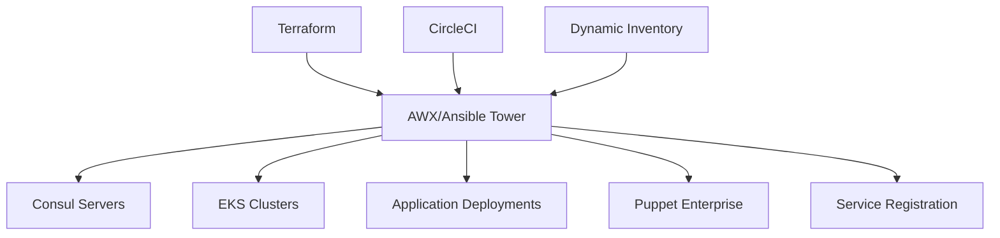
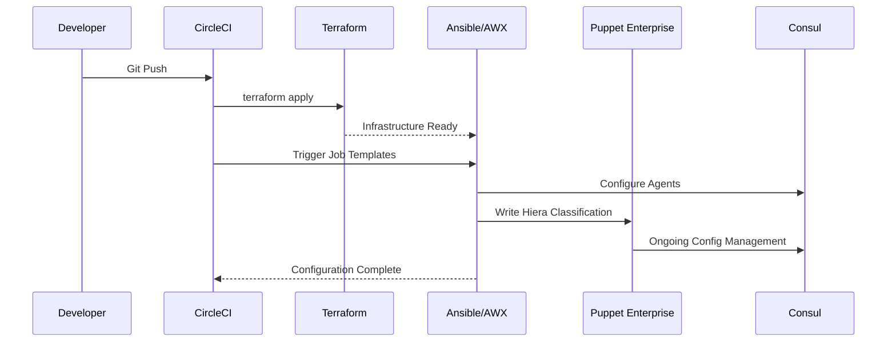

# 🏗️ AWX (Ansible Tower) Integration Guide

> 📦 **Image Management**: See [AWX Image Management](./awx-image-management.md) for managing AWX container images with JFrog Artifactory to avoid Docker Hub rate limiting.

This guide covers the complete setup and integration of Ansible AWX with your multi-cloud infrastructure.

## 📋 Overview

AWX provides enterprise-grade configuration management for your multi-cloud DevOps platform. This integration follows your comprehensive architecture plan for **Day-0/1 provisioning** and **Day-2 configuration management**.

### 🎯 **Architecture Integration**



## 🚀 **Deployment Status**

Your AWX platform is now integrated with:

- ✅ **ECS Fargate** deployment for high availability
- ✅ **Aurora PostgreSQL** database for persistent storage
- ✅ **Application Load Balancer** with health checks
- ✅ **AWS Secrets Manager** for secure credential management
- ✅ **Dynamic inventory** from Terraform state
- ✅ **Multi-cloud support** for AWS, GCP, and Azure
- ✅ **Service discovery** integration with Consul

## 🔗 **Access Information**

After deployment, get your AWX connection details:

```bash
# Get AWX URL and credentials
cd terraform/envs/dev/us-east-2
terragrunt output awx_url
terragrunt output awx_admin_password  # Sensitive output
```

**Default Access:**
- **URL**: Provided in Terraform outputs
- **Username**: `admin`
- **Password**: Auto-generated (stored in AWS Secrets Manager)

## 📚 **Available Playbooks**

### **1. Consul Management** (`ansible/playbooks/consul-setup.yml`)
```yaml
# Manages Consul agents across your infrastructure
- Day-0/1 Consul agent installation
- Service registration and health checks
- Multi-datacenter federation setup
- Security configuration
```

### **2. Kubernetes Management** (`ansible/playbooks/kubernetes-management.yml`)
```yaml
# Manages EKS clusters and applications
- Namespace management
- JFrog image pull secrets
- Application deployment health checks
- Consul service mesh integration
```

## 🏗️ **Creating Job Templates in AWX**

### **1. Setup Dynamic Inventory**

1. **Navigate to Inventories** → **Add Inventory**
2. **Create "Terraform Dynamic Inventory"**
3. **Add Source**:
   - **Source**: Custom Script
   - **Custom Inventory Script**: Upload `ansible/inventory/terraform-inv.py`
   - **Environment Variables**:
     ```bash
     TERRAFORM_ENV=dev
     TERRAFORM_REGION=us-east-2
     ```

### **2. Create Consul Management Job**

1. **Navigate to Templates** → **Add Job Template**
2. **Configuration**:
   ```yaml
   Name: "Consul Agent Management"
   Job Type: Run
   Inventory: Terraform Dynamic Inventory
   Project: <Your Git Project>
   Playbook: ansible/playbooks/consul-setup.yml
   Credential: AWS/SSH Credentials
   ```

3. **Variables**:
   ```yaml
   vault_consul_gossip_key: "{{ consul_gossip_key }}"
   consul_datacenter: "aws-dev-us-east-2"
   ```

### **3. Create Kubernetes Management Job**

1. **Navigate to Templates** → **Add Job Template**
2. **Configuration**:
   ```yaml
   Name: "Kubernetes Cluster Management"
   Job Type: Run
   Inventory: Terraform Dynamic Inventory
   Project: <Your Git Project>
   Playbook: ansible/playbooks/kubernetes-management.yml
   Credential: AWS Credentials
   ```

## 🔄 **Integration with CircleCI**

Following your architecture plan: **"Invoked by CircleCI post‑Terraform"**

Add this to your `.circleci/config.yml`:

```yaml
- name: Trigger AWX Configuration Management
  command: |
    # Trigger AWX job templates via API
    curl -X POST "${AWX_URL}/api/v2/job_templates/${JOB_TEMPLATE_ID}/launch/" \
      -H "Authorization: Bearer ${AWX_API_TOKEN}" \
      -H "Content-Type: application/json" \
      -d '{"extra_vars": {"environment": "'${CIRCLE_BRANCH}'"}}'
```

## 🔐 **Security & Credentials**

### **AWS Integration**
- AWX task role has permissions for EC2, EKS, and Secrets Manager
- Uses IAM roles for secure cloud access
- Secrets stored in AWS Secrets Manager

### **SSH Access**
- Consul servers use auto-generated SSH keys
- Keys stored in AWS Secrets Manager
- Automatic key rotation capability

### **Vault Integration** (Future)
- Ready for HashiCorp Vault integration
- Secrets sourced via `argocd-vault-plugin`
- Performance replication across regions

## 📊 **Monitoring & Observability**

AWX integrates with your observability stack:

### **Metrics Export**
```yaml
# Job execution metrics sent to Prometheus
awx_job_success_total{template="consul-setup"} 1
awx_job_duration_seconds{template="consul-setup"} 45.2
awx_inventory_hosts_total{source="terraform"} 8
```

### **Logging Integration**
- **CloudWatch Logs**: `/ecs/dev-awx/*`
- **Grafana Dashboards**: AWX job execution metrics
- **AlertManager**: Failed job notifications

## 🔄 **Day-2 Operations Workflow**

Your architecture plan's complete workflow:



## 🎯 **Use Cases**

### **1. Consul Agent Deployment**
```bash
# AWX Job Template: "Consul Agent Management"
# Targets: consul_servers group
# Outcome: Fully configured Consul cluster
```

### **2. Application Scaling**
```bash
# AWX Job Template: "Kubernetes Management" 
# Extra Vars: {"replicas": 5, "force_restart": true}
# Outcome: Scaled applications with health verification
```

### **3. Cross-Cloud Service Registration**
```bash
# AWX Job Template: "Multi-Cloud Service Discovery"
# Targets: multicloud group
# Outcome: Services registered across AWS, GCP, Azure
```

## 🛠️ **Troubleshooting**

### **Common Issues**

**1. Dynamic Inventory Empty**
```bash
# Check Terraform outputs
cd terraform/envs/dev/us-east-2
terragrunt output -json

# Test inventory script
python3 ansible/inventory/terraform-inv.py --list
```

**2. Consul Connection Issues**
```bash
# Check security groups
# Verify Consul gossip encryption key
# Confirm service discovery namespace
```

**3. ECS Task Failures**
```bash
# Check CloudWatch logs
aws logs describe-log-groups --log-group-name-prefix "/ecs/dev-awx"

# Verify secrets access
aws secretsmanager get-secret-value --secret-id dev-awx-admin-password
```

## 📋 **Next Steps**

Following your comprehensive architecture:

### **Phase 1** ✅ - **Complete**
- AWX deployment on ECS Fargate
- Dynamic inventory from Terraform
- Basic Consul and Kubernetes management

### **Phase 2** 🔄 - **Next**
- Puppet Enterprise integration
- Hiera classification files
- Advanced service mesh configuration

### **Phase 3** 🚀 - **Future**
- HashiCorp Vault integration
- Cross-cloud VPN automation
- Advanced policy enforcement

## 🏆 **Achievement Unlocked**

You now have **enterprise-grade configuration management** that:

- ✅ **Automates Day-0/1 provisioning** of OS, middleware, and Consul agents
- ✅ **Integrates with CI/CD** pipeline for post-Terraform automation
- ✅ **Sources inventory** dynamically from Terraform state
- ✅ **Manages multi-cloud** infrastructure consistently
- ✅ **Prepares for Puppet** integration for Day-2 operations
- ✅ **Scales with your** growing infrastructure needs

Your multi-cloud DevOps platform now has the **configuration management backbone** required for enterprise operations! 🎉 